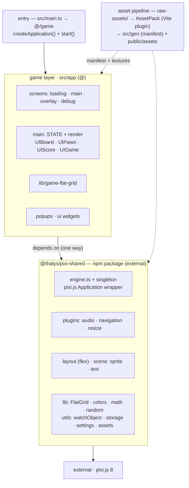

# Architecture

A visual companion to the architecture notes in [AGENTS.md](../AGENTS.md). For commands, path aliases, and tooling
details, see AGENTS.md; this page focuses on how the pieces fit and the boundaries that matter.

## Overview

## Layers

| Layer         | Alias | Path                  | Responsibility                                                                                                                          |
| ------------- | ----- | --------------------- | --------------------------------------------------------------------------------------------------------------------------------------- |
| Game          | `@/*` | `src/app/`            | The 2048 game: screens, reactive `STATE`, board UI, popups, widgets.                                                                    |
| Engine        | —     | `@thalys/pixi-shared` | "Creation Engine" npm package: pixi.js `Application` wrapper, navigation, layout, scene helpers, utilities. Imported by subpath export. |
| Build tooling | `#/*` | `scripts/`            | AssetPack/Vite plugins and build scripts (runtime-agnostic on the Vite plugin chain).                                                   |
| Generated     | —     | `src/gen/`            | Asset manifest + types produced by AssetPack. Never edited by hand.                                                                     |
| Source assets | —     | `raw-assets/`         | Inputs to AssetPack; output is gitignored `public/assets/`.                                                                             |

## The boundary that matters

Game code imports from `@thalys/pixi-shared` subpaths (e.g. `@thalys/pixi-shared/engine`,
`@thalys/pixi-shared/lib/flat-grid`). The engine package has no knowledge of the game — it is a generic PixiJS wrapper.
Game-specific behaviour (screen routing, asset manifest init) is injected by the game at startup.

See [ADR 0002](decisions/0002-extract-shared-engine-and-asset-pipeline.md) — engine extraction is complete as of v0.1.0.
