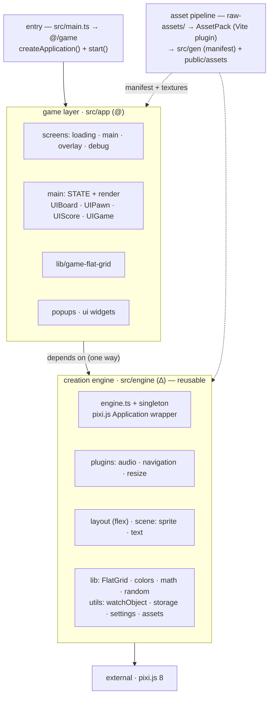

# Architecture

A visual companion to the architecture notes in [AGENTS.md](../AGENTS.md). For commands, path aliases, and tooling details, see AGENTS.md; this page focuses on how the pieces fit and the boundaries that matter.

## Overview

## Layers

| Layer | Alias | Path | Responsibility |
| ----- | ----- | ---- | -------------- |
| Game | `@/*` | `src/app/` | The 2048 game: screens, reactive `STATE`, board UI, popups, widgets. |
| Engine | `∆/*` | `src/engine/` | "Creation Engine": a thin wrapper over the pixi.js `Application` plus navigation, layout, scene helpers, and utilities. |
| Build tooling | `#/*` | `scripts/` | AssetPack/Vite plugins and build scripts (runtime-agnostic on the Vite plugin chain). |
| Generated | — | `src/gen/` | Asset manifest + types produced by AssetPack. Never edited by hand. |
| Source assets | — | `raw-assets/` | Inputs to AssetPack; output is gitignored `public/assets/`. |

## The boundary that matters

**The engine never imports from `@/` (game code).** The dependency flows one way: game → engine. That single invariant is what makes `src/engine/` extractable into a shared package without untangling game logic.

See [ADR 0002](decisions/0002-extract-shared-engine-and-asset-pipeline.md) for the plan to extract the asset pipeline and engine into reusable `@thalys` packages.
